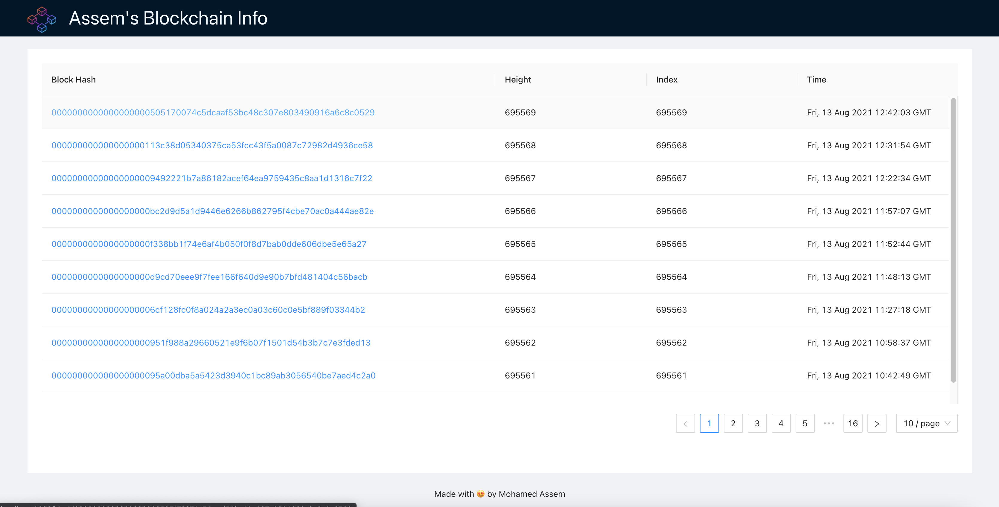
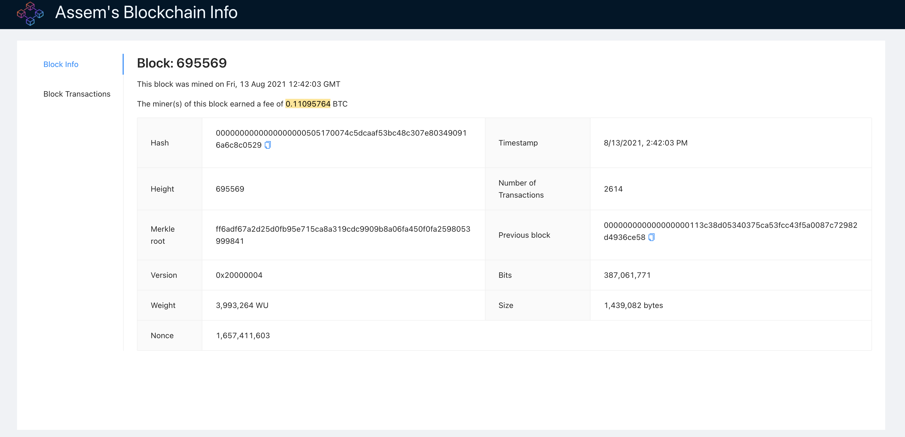
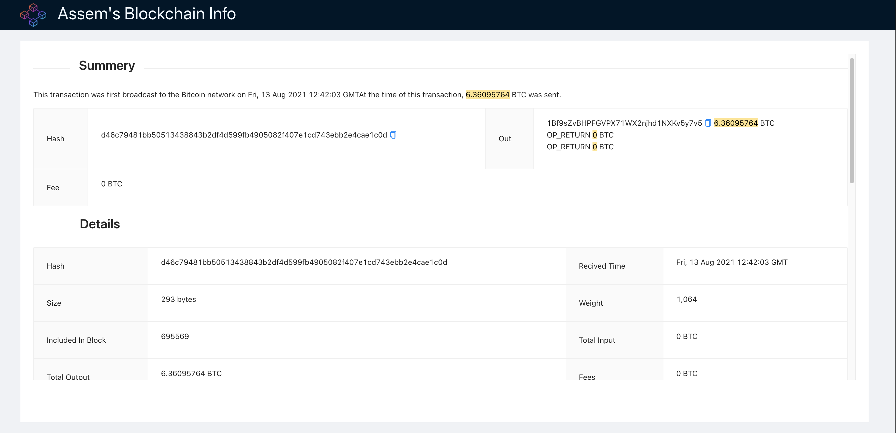
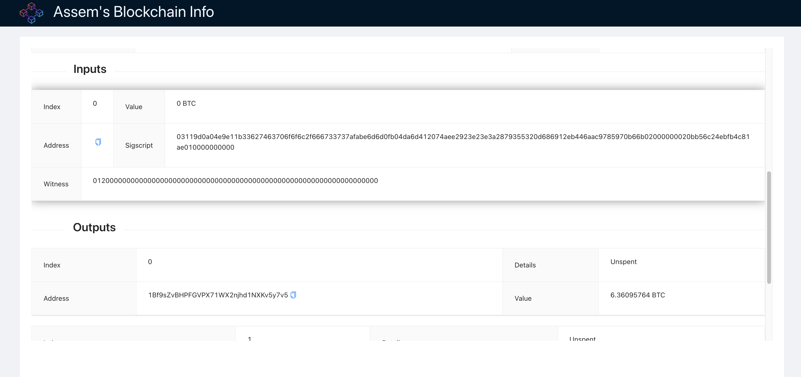

## Available Scripts

In the project directory, you can run:

### `yarn`

Install node_modules

### `yarn start`

Runs the app in the development mode.\
Open [http://localhost:3000](http://localhost:3000) to view it in the browser.

## Available Routes & Pages

In this project you can navigate to:

### `http://localhost:3000/blocks`

This will route you to all blocks table where you can select any block to view it's details

### `http://localhost:3000/block/{BLOCK_HASH}`

This will route you to block details page which have 2 tabs first one will show block details second one will show block transactions with pagination

### `http://localhost:3000/transaction/{TRANSACTION_HASH}`

This will route you to transaction details showing all information regarding single transaction

