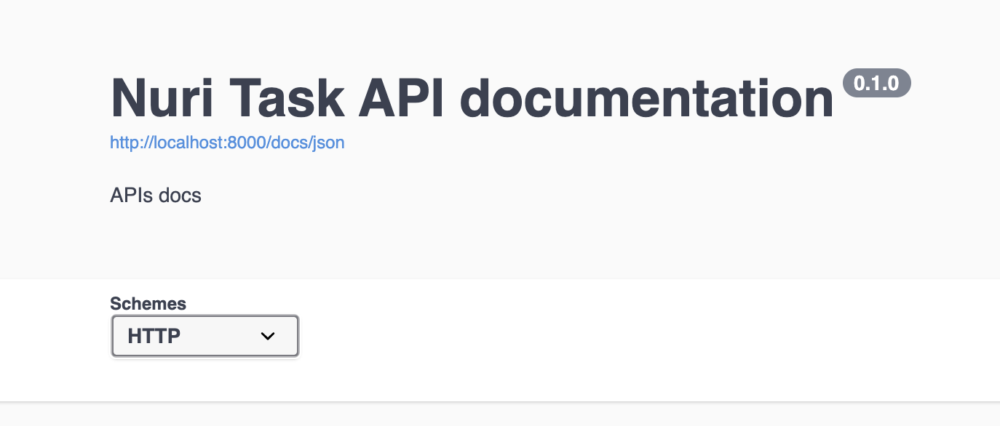

# Mohamed Assem's Backend Task

## About
This backend application built using Fastify, Typescript and Redis for caching
---

## Start
### Install packages `yarn`

### Run application `npm run dev`

### Swagger
`http://localhost:8000/docs`


---

## API's
---

### Get latest blocks with pagination
`http://localhost:8000/blocks/?limit=10&offset=0`

**Accepts**: `limit` and `offset` as query string params

**Returnes**: Array of blocks objects and total count of blocks
```
{
  "data": [
    {
      "hash": "00000000000000000001c0969a82bd0e4a6895a58d06267ff2dfdecced0513a6",
      "height": 695488,
      "time": 1628812459,
      "block_index": 695488
    },
    ...
  ],
  "totalCount": 150
}
```
---

### Get block by it's hash
`http://localhost:8000/blocks/0000000000000000000858e8faa9875ea4e3e50eabf8151982bec797c6dc6102`

**Accepts**: `hash` as param

**Returnes**: block object
```
{
  "size": 187461,
  "blockIndex": 695485,
  "previousHash": "0000000000000000000241966d986c929f1f35f5bde2f533040229bcb0a5f0ae",
  "nonce": 1328223766,
  "tx": [
    "b55b7cc751501b4d912c09e22843b26ad32eaf06d4ab28743119c1a759d0e934",
    "83e58b79e593956c12ddfe920ced39353ef57c1ad3672e5571c5cee873c76df7",
    "6957ba1deec835527766b2c651ed43999e64e6d9c5333a930047f27dce437425",
    "efff6e50e0ef3f6dcb4bb4f16ac88aad4cd4aed833691781538e37af3d96737c",
    "8d186b37f34a66c716450614c3751e218d781c1dce723bd61caba868166f1096",
    "37cdd437841c78e9517aeec92f481240865ece97d7bf203eef4248acff2d45c3",
    "9a9c7e79f89290e43fc26c7a3154c411597a1b8a9851b888725a8d0fb78c1d61",
    "824e67ee96f37aef8795c31165c8f0ffa4efbfa484e5d3b094f3bfd12fbb5cd0",
    "54b4fb33959ec9b3a6ee2e7b01d3dccd5a801d946131d677e831550182912614",
    "59968f7d143b468caf0f54356878ff3897324e3ee32baa04640472ede5b7e01f",
    ...
  ]
}
```
---

### Get transaction by it's hash
`http://localhost:8000/transactions/b55b7cc751501b4d912c09e22843b26ad32eaf06d4ab28743119c1a759d0e934`

**Accepts**: `hash` as param

**Returnes**: transaction object
```
{
  "hash": "b55b7cc751501b4d912c09e22843b26ad32eaf06d4ab28743119c1a759d0e934",
  "ver": 1,
  "vin_sz": 1,
  "vout_sz": 3,
  "size": 296,
  "weight": 1076,
  "fee": 0,
  "relayed_by": "0.0.0.0",
  "lock_time": 0,
  "tx_index": 1861722481948707,
  "double_spend": false,
  "time": 1628811168,
  "block_index": 695485,
  "block_height": 695485,
  "inputs": [
    {
      "sequence": 0,
      "witness": "01200000000000000000000000000000000000000000000000000000000000000000",
      "script": "03bd9c0afabe6d6d6e0a264e3507d47082bd1c3ab9cd71ddae5d27a329d0f31620cc6b3c41d6298a010000000000000003650502ca7e4812c50200000000007fdadcea142f736c7573682f",
      "index": 0,
      "prev_out": null
    }
  ],
  "out": [
    {
      "type": 0,
      "spent": false,
      "value": 626781427,
      "spending_outpoints": [],
      "n": 0,
      "tx_index": 1861722481948707,
      "script": "76a9147c154ed1dc59609e3d26abb2df2ea3d587cd8c4188ac",
      "addr": "1CK6KHY6MHgYvmRQ4PAafKYDrg1ejbH1cE"
    },
    {
      "type": 0,
      "spent": false,
      "value": 0,
      "spending_outpoints": [],
      "n": 1,
      "tx_index": 1861722481948707,
      "script": "6a4c2952534b424c4f434b3afb0983ba70d1774e7cf672cf4b1a26536c7d30dcc5230d3b45ff57260036dfde"
    },
    {
      "type": 0,
      "spent": false,
      "value": 0,
      "spending_outpoints": [],
      "n": 2,
      "tx_index": 1861722481948707,
      "script": "6a24aa21a9ed933db37e7681e280266d189aaa56a29afa68e315a1722961bf1649ee691c5032"
    }
  ]
}
```